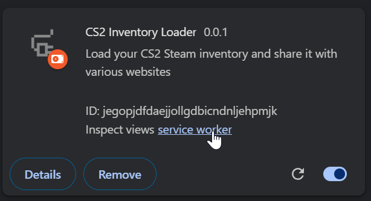

# CS2 Inventory Extension
Our goal is to standarize the `window.cs2inventory` api for all extensions to use. Any extension can provide spec-compliant implementation of `window.cs2inventory` for any site to use. This way users can benefit from extension on all websites, similarly to how many web3 wallets share the same API.

Discuss: https://discord.gg/kXJGt9vPhy


### API
```ts
function loadInventory(appId: number, contextId: number | string): Promise<SteamInventory>
```

### Usage (host site)
Check if cs2inventory is present in user browser. Fetch inventory using the extension and send to your API for processing

```html
<script>
  // Client-side code, this is executed in browser
  if ('cs2inventory' in window) {
    const inventory = await window.cs2inventory.loadInventory(730, 2)
    reportUserInventory(inventory)
  }

  async function reportUserInventory(inventory) {
    // All request to this endpoint should be treated as UNSAFE
    return fetch('/api/report-user-inventory', {
      method: 'POST',
      body: JSON.stringify(inventory)
    })
  }
</script>
```

### Install

Build the extension in development or production mode:

```bash
npm install
npm run dev
```

Then load the extension into your browser:
1. Visit `chrome://extensions`
2. Enable developer mode (upper right corner)
3. Click "Load unpacked"
4. Select `build/chrome-mv3-dev` directory from this repository

### Logs
1. Visit `chrome://extensions`
2. Click "service worker" under the extension card


